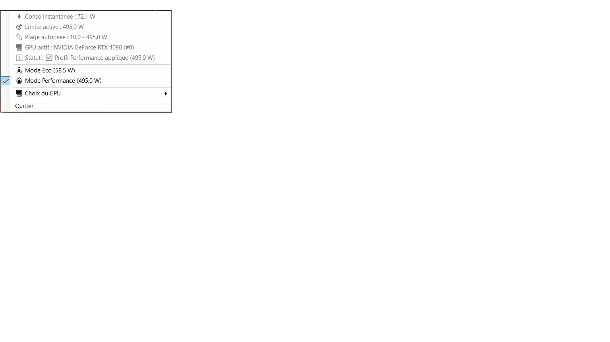
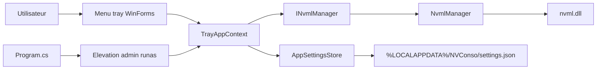

# NVConso
Utilitaire Windows (WinForms) en zone de notification pour piloter la limite de puissance d'un GPU NVIDIA via NVML.

[](https://github.com/arnaud-wissart/NVConso/actions/workflows/ci.yml)
[](./LICENSE)
[](./NVConso/NVConso.csproj)
[](./NVConso/NVConso.csproj)

## Demo live
- Demo live: TODO (application desktop Windows, aucune instance publique referencee dans ce depot).
- Release: [GitHub Releases](https://github.com/arnaud-wissart/NVConso/releases) - TODO (aucun workflow de release detecte dans [`.github/workflows/`](./.github/workflows/) et aucun tag git local detecte).

## Ce que ca demontre
- Conception d'une application WinForms sans fenetre principale, pilotee par `NotifyIcon` et menu contextuel tray ([`NVConso/TrayApplicationContext.cs`](./NVConso/TrayApplicationContext.cs)).
- Interop natif C# vers NVML (`nvml.dll`) en `DllImport` pour enumerer les GPU, lire la consommation et modifier le power limit ([`NVConso/NvmlManager.cs`](./NVConso/NvmlManager.cs)).
- Gestion multi-GPU avec selection dynamique et affichage de la plage min/max du GPU actif ([`NVConso/TrayApplicationContext.cs`](./NVConso/TrayApplicationContext.cs)).
- Gestion explicite des privileges administrateur (`requireAdministrator` + relance `runas`) pour appliquer `nvmlDeviceSetPowerManagementLimit` ([`NVConso/app.manifest`](./NVConso/app.manifest), [`NVConso/Program.cs`](./NVConso/Program.cs)).
- Persistance locale resiliente des preferences utilisateur (`%LOCALAPPDATA%\\NVConso\\settings.json`) avec fallback sur valeurs par defaut ([`NVConso/AppSettingsStore.cs`](./NVConso/AppSettingsStore.cs)).
- Testabilite via abstraction `INvmlManager` + mock (`MockNvmlManager`) et tests unitaires xUnit ([`NVConso/INvmlManager.cs`](./NVConso/INvmlManager.cs), [`NVConso.Tests/`](./NVConso.Tests/)).
- Pipeline CI Windows sur GitHub Actions (restore/build/test) ([`.github/workflows/ci.yml`](./.github/workflows/ci.yml)).

## Captures
- Capture disponible:



- TODO: ajouter 1 a 3 captures supplementaires dans [`docs/screenshots/`](./docs/screenshots/) pour atteindre 2 a 4 vues.
- Convention recommandee:
- `docs/screenshots/tray-menu.png`
- `docs/screenshots/gpu-selection.png`
- `docs/screenshots/power-limit-status.png`

## Architecture


### Comment ca marche
1. Au lancement, l'application initialise WinForms puis demande l'elevation admin si necessaire ([`NVConso/Program.cs`](./NVConso/Program.cs)).
2. `TrayAppContext` initialise NVML, charge la liste GPU, puis selectionne le GPU sauvegarde (ou le premier disponible) ([`NVConso/TrayApplicationContext.cs`](./NVConso/TrayApplicationContext.cs)).
3. Les profils `Eco` et `Performance` calculent/appliquent une limite de puissance en milliwatts via NVML (Eco = min + 10% de l'intervalle, Performance = max) ([`NVConso/Constants.cs`](./NVConso/Constants.cs), [`NVConso/NvmlManager.cs`](./NVConso/NvmlManager.cs)).
4. Un timer (1 s) met a jour la telemetrie (consommation instantanee et limite active), et les choix utilisateur sont persistes en JSON ([`NVConso/TrayApplicationContext.cs`](./NVConso/TrayApplicationContext.cs), [`NVConso/AppSettingsStore.cs`](./NVConso/AppSettingsStore.cs)).

## Stack technique
- Runtime/UI: .NET `net8.0-windows`, WinForms ([`NVConso/NVConso.csproj`](./NVConso/NVConso.csproj)).
- Plateforme cible: `x64` ([`NVConso/NVConso.csproj`](./NVConso/NVConso.csproj)).
- Interop GPU: NVML (`nvml.dll`) via `DllImport` ([`NVConso/NvmlManager.cs`](./NVConso/NvmlManager.cs)).
- Injection de dependances et logging: `Microsoft.Extensions.DependencyInjection`, `Microsoft.Extensions.Logging`, `Microsoft.Extensions.Logging.Console` ([`NVConso/NVConso.csproj`](./NVConso/NVConso.csproj)).
- Package present dans le projet: `NvAPIWrapper.Net` ([`NVConso/NVConso.csproj`](./NVConso/NVConso.csproj)).
- WMI: non detecte dans le code actuel.
- Tests: xUnit + `Microsoft.NET.Test.Sdk` + `coverlet.collector` ([`NVConso.Tests/NVConso.Tests.csproj`](./NVConso.Tests/NVConso.Tests.csproj)).
- CI: GitHub Actions sur `windows-latest` ([`.github/workflows/ci.yml`](./.github/workflows/ci.yml)).

## Demarrage rapide (dev local)
Prerequis:
- Windows.
- SDK .NET 8.x (la CI utilise `8.x` en fallback).
- Pilote NVIDIA installe (pour `nvml.dll`).
- Droits administrateur (requis pour modifier la limite de puissance).

Restaurer, builder, lancer:

```powershell
dotnet restore Tools.sln
dotnet build Tools.sln --configuration Debug
dotnet run --project NVConso/NVConso.csproj
```

Build Release (commande CI):

```powershell
dotnet build Tools.sln --configuration Release --no-restore
```

Packaging binaire/release:
- TODO (aucun script `dotnet publish`, aucun workflow de release, aucun installateur detecte dans ce depot).

## Tests
Tests unitaires (projet de tests):

```powershell
dotnet test NVConso.Tests/NVConso.Tests.csproj --configuration Release --no-build
```

Validation locale complete (documentation maintenance):

```powershell
dotnet restore Tools.sln
dotnet build Tools.sln -c Debug
dotnet test Tools.sln -c Debug
```

Type de tests detectes:
- Unitaires: oui ([`NVConso.Tests/`](./NVConso.Tests/)).
- Integration: TODO (non detecte).
- E2E: TODO (non detecte).

## Securite & configuration
- Privileges: niveau `requireAdministrator` dans le manifest et relance `runas` au demarrage ([`NVConso/app.manifest`](./NVConso/app.manifest), [`NVConso/Program.cs`](./NVConso/Program.cs)).
- Pourquoi admin: l'ecriture du power limit passe par `nvmlDeviceSetPowerManagementLimit`, qui peut etre refusee sans elevation ([`NVConso/NvmlManager.cs`](./NVConso/NvmlManager.cs)).
- Variables d'environnement: aucune variable `.env` / secret detectee dans le code actuel.
- Configuration locale persistante: `%LOCALAPPDATA%\\NVConso\\settings.json`.

Exemple de `settings.json` (placeholders):

```json
{
  "SelectedGpuIndex": "<index_gpu>",
  "AutoApplySavedMode": "<true_or_false>",
  "HasSavedMode": "<true_or_false>",
  "LastSelectedMode": "<Eco_or_Performance>"
}
```

- Bonnes pratiques:
- Ne pas commiter de secrets dans le depot.
- Garder les valeurs machine/utilisateur dans le fichier local `%LOCALAPPDATA%`.

## Licence
Licence MIT. Voir [LICENSE](./LICENSE).
