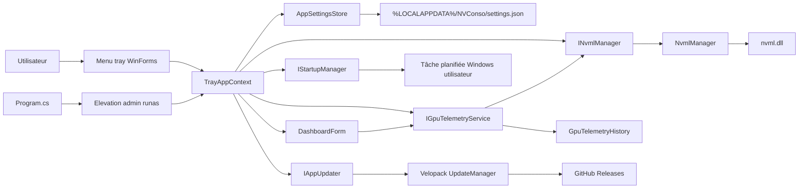

# NVConso
Utilitaire Windows (WinForms) en zone de notification pour piloter la limite de puissance d'un GPU NVIDIA via NVML.

[](https://github.com/arnaud-wissart-lab/NVConso/actions/workflows/ci.yml)
[](./LICENSE)
[](./NVConso/NVConso.csproj)
[](./NVConso/NVConso.csproj)

## Téléchargement
- Dernière version: [`/releases/latest`](https://github.com/arnaud-wissart-lab/NVConso/releases/latest)
- Version installée auto-updatable: installeur Velopack `NVConso-Setup.exe` et paquets associés, publiés sur le canal `stable` pour `win-x64`.
- Version portable: archive ZIP self-contained `NVConso-win-x64.zip`. Elle ne nécessite pas d'installation .NET, mais ne bénéficie pas de l'auto-update complet.
- Fichier `SHA256SUMS.txt` fourni avec chaque release pour vérifier les artefacts publiés.

## Démo live
- Démo live: Application desktop Windows, aucune instance publique référencée dans ce dépôt.
- Release: [GitHub Releases](https://github.com/arnaud-wissart-lab/NVConso/releases).

## Ce que ça démontre
- Conception d'une application WinForms sans fenêtre principale, pilotée par `NotifyIcon` et menu contextuel tray ([`NVConso/TrayApplicationContext.cs`](./NVConso/TrayApplicationContext.cs)).
- Tableau de bord WinForms optionnel, ouvert depuis le tray, avec cartes de métriques, jauges et graphes locaux sur 5 minutes ([`NVConso/DashboardForm.cs`](./NVConso/DashboardForm.cs)).
- Fenêtre `Préférences` WinForms centralisant les options utilisateur : général, profils, Canicule Guard, démarrage Windows, mises à jour, apparence et avancé ([`NVConso/SettingsForm.cs`](./NVConso/SettingsForm.cs)).
- Interop natif C# vers NVML (`nvml.dll`) en `DllImport` pour énumérer les GPU, lire la télémétrie et modifier le power limit ([`NVConso/NvmlManager.cs`](./NVConso/NvmlManager.cs)).
- Gestion multi-GPU avec sélection dynamique et affichage de la plage min/max du GPU actif ([`NVConso/TrayApplicationContext.cs`](./NVConso/TrayApplicationContext.cs)).
- Gestion explicite des privilèges administrateur (`requireAdministrator` + relance `runas`) pour appliquer `nvmlDeviceSetPowerManagementLimit` ([`NVConso/app.manifest`](./NVConso/app.manifest), [`NVConso/Program.cs`](./NVConso/Program.cs)).
- Démarrage avec Windows via une tâche planifiée utilisateur à l'ouverture de session, configurée avec les privilèges les plus élevés et sans mot de passe stocké ([`NVConso/WindowsTaskSchedulerStartupManager.cs`](./NVConso/WindowsTaskSchedulerStartupManager.cs)).
- Mises à jour via Velopack et GitHub Releases: vérification manuelle ou périodique, téléchargement explicite, puis installation avec redémarrage uniquement après consentement utilisateur ([`NVConso/VelopackAppUpdater.cs`](./NVConso/VelopackAppUpdater.cs)).
- Persistance locale résiliente des préférences utilisateur (`%LOCALAPPDATA%\\NVConso\\settings.json`) avec fallback sur valeurs par défaut ([`NVConso/AppSettingsStore.cs`](./NVConso/AppSettingsStore.cs)).
- Testabilité via abstraction `INvmlManager` + mock (`MockNvmlManager`) et tests unitaires xUnit ([`NVConso/INvmlManager.cs`](./NVConso/INvmlManager.cs), [`NVConso.Tests/`](./NVConso.Tests/)).
- Pipeline CI Windows sur GitHub Actions (restore/build/test/audit packages) ([`.github/workflows/ci.yml`](./.github/workflows/ci.yml)).

## Captures


TODO: mettre à jour cette capture après génération sur une machine Windows avec pilote NVIDIA et accès NVML. La capture actuelle peut ne pas refléter tous les items récents du menu tray.

TODO: ajouter une capture du tableau de bord après validation visuelle sur une machine Windows avec pilote NVIDIA et télémétrie NVML disponible.

## Interface
NVConso reste une application WinForms légère, avec le menu natif de la zone de notification comme point d'entrée principal. Les entrées du menu sont groupées par usage : statut, profils, tableau de bord, options, mises à jour et arrêt.

Le tableau de bord est une fenêtre WinForms optionnelle, construite avec des contrôles internes simples : cartes de métriques, jauges GDI+, pastille de statut, boutons de profil et graphes locaux. Aucune migration vers WPF, WinUI, Avalonia ou MAUI n'est faite dans cette passe, et aucun framework UI massif n'est introduit.

La couche de thème centralise les couleurs, espacements, rayons, polices et états visuels. Les thèmes disponibles sont `System`, `Light` et `Dark`. L'état des métriques reste lisible par le texte et les valeurs affichées, pas uniquement par la couleur.

La fenêtre `Préférences...` est accessible depuis le tray et depuis le tableau de bord. Elle centralise les options qui ne doivent pas rester uniquement dans le menu contextuel : démarrage réduit, restauration `Stock`, dashboard au démarrage, thème, profil de démarrage, démarrage Windows via tâche planifiée, mises à jour, durée d'historique graphique, chemin du fichier `settings.json`, export diagnostic et réinitialisation locale des préférences.

Les valeurs numériques sont bornées avant sauvegarde. Le fichier `%LOCALAPPDATA%\\NVConso\\settings.json` est chargé avec fallback résilient et écrit via un fichier temporaire avant remplacement, afin d'éviter autant que possible les écritures partielles.

Les réglages `Canicule Guard` sont centralisés et validés dans les préférences. La logique d'alerte automatique associée reste à brancher explicitement si elle évolue dans une passe dédiée.

## Profils GPU
NVConso ajuste le `power limit` NVIDIA, c'est-à-dire un plafond de puissance. Ce plafond ne force pas la carte à consommer cette valeur en permanence : le GPU consomme seulement ce dont il a besoin, jusqu'à la limite appliquée.

Les limites sont calculées depuis les contraintes NVML du GPU actif:
- `Canicule`: limite minimale exposée par NVML.
- `VideoSurf`: minimum + 10 % de l'intervalle entre minimum et stock/default.
- `Indie2D`: minimum + 25 % de l'intervalle entre minimum et stock/default.
- `Stock`: limite stock/default constructeur lue depuis NVML quand elle est disponible. Si NVML ne fournit pas cette valeur, NVConso privilégie la limite active comme secours ; si elle est aussi indisponible, il utilise la limite minimale plutôt que `Max`.
- `Max`: limite maximale autorisée par le GPU/BIOS.
- `Custom`: limite personnalisée saisie en watts, validée contre la plage NVML autorisée.

`Stock` et `Max` sont volontairement distincts. `Stock` revient au comportement constructeur normal, tandis que `Max` applique le plafond maximal autorisé par la carte. `Max` est destiné aux gros jeux, benchmarks ou essais volontaires, pas au surf, à la vidéo ou à la bureautique.

## Usage recommandé en période de canicule
- `Canicule`: bureautique, surf léger, vidéo simple, priorité au silence et à la chaleur minimale.
- `VideoSurf`: navigation plus lourde, vidéo haute résolution, appels visio ou multitâche léger.
- `Indie2D`: petits jeux peu gourmands, jeux 2D ou titres indés modestes.
- `Stock`: retour normal avant une session de jeu classique ou après une phase basse consommation.
- `Max`: usage volontairement agressif pour gros jeux ou benchmarks, à éviter pour surf/vidéo.
- `Custom`: réglage manuel si vous connaissez une limite stable pour votre GPU et votre usage.

## Ce que NVConso ne fait pas
- Ne désactive pas automatiquement RTX Video, RTX HDR ou d'autres traitements NVIDIA.
- Ne modifie pas les paramètres Chrome, Edge ou d'autres navigateurs.
- Ne contrôle pas les ventilateurs dans cette version.
- Ne remplace pas NVIDIA App.
- Ne bascule pas automatiquement une application vers un iGPU.

## Architecture


### Comment ça marche
1. Au lancement, l'application initialise WinForms puis demande l'élévation admin si nécessaire ([`NVConso/Program.cs`](./NVConso/Program.cs)).
2. `TrayAppContext` initialise NVML, charge la liste GPU, puis sélectionne le GPU sauvegardé (ou le premier disponible) ([`NVConso/TrayApplicationContext.cs`](./NVConso/TrayApplicationContext.cs)).
3. Les profils `Canicule`, `VideoSurf`, `Indie2D`, `Stock` et `Max` calculent/appliquent une limite de puissance en milliwatts via NVML, à partir des limites minimum, stock/default et maximum exposées par le GPU ([`NVConso/Constants.cs`](./NVConso/Constants.cs), [`NVConso/NvmlManager.cs`](./NVConso/NvmlManager.cs)).
4. Une limite personnalisée peut être saisie en watts depuis le menu tray, puis validée strictement contre la plage NVML autorisée.
5. Un service central `IGpuTelemetryService` interroge NVML au maximum une fois par seconde, publie un snapshot partagé et alimente un historique circulaire en mémoire. Le tray et le dashboard consomment cette même source, sans double polling NVML.
6. L'option `Démarrer avec Windows` crée ou met à jour une tâche planifiée `NVConso` déclenchée à l'ouverture de session de l'utilisateur courant. L'action pointe vers le chemin complet de `NVConso.exe`, avec `--tray` ou `--minimized` comme argument et le dossier de l'exécutable comme dossier de travail.
7. L'option `Rechercher une mise à jour` utilise Velopack avec les releases GitHub du dépôt. Si une version plus récente existe sur le canal `stable`, NVConso peut la télécharger, afficher `Mise à jour prête`, puis l'appliquer avec redémarrage seulement après validation utilisateur.

## Stack technique
- Runtime/UI: .NET `net8.0-windows`, WinForms ([`NVConso/NVConso.csproj`](./NVConso/NVConso.csproj)).
- Plateforme cible: `x64` ([`NVConso/NVConso.csproj`](./NVConso/NVConso.csproj)).
- Interop GPU: NVML (`nvml.dll`) via `DllImport` ([`NVConso/NvmlManager.cs`](./NVConso/NvmlManager.cs)).
- Visualisation: contrôles WinForms/GDI+ internes pour cartes, jauges et graphes afin d'éviter une dépendance UI lourde ([`NVConso/TelemetryChartControl.cs`](./NVConso/TelemetryChartControl.cs)).
- Injection de dépendances et logging: `Microsoft.Extensions.DependencyInjection`, `Microsoft.Extensions.Logging`, `Microsoft.Extensions.Logging.Console` ([`NVConso/NVConso.csproj`](./NVConso/NVConso.csproj)).
- Installation et auto-update: Velopack 1.2.x avec source GitHub Releases ([`NVConso/VelopackAppUpdater.cs`](./NVConso/VelopackAppUpdater.cs)).
- Package présent dans le projet: `NvAPIWrapper.Net` ([`NVConso/NVConso.csproj`](./NVConso/NVConso.csproj)).
- WMI: non détecté dans le code actuel.
- Tests: xUnit + `Microsoft.NET.Test.Sdk` + `coverlet.collector` ([`NVConso.Tests/NVConso.Tests.csproj`](./NVConso.Tests/NVConso.Tests.csproj)).
- CI: GitHub Actions sur `windows-latest` ([`.github/workflows/ci.yml`](./.github/workflows/ci.yml)).

## Démarrage rapide (dev local)
Prérequis:
- Windows.
- SDK .NET 8.x (la CI utilise `8.x` en fallback).
- Pilote NVIDIA installé (pour `nvml.dll`).
- Droits administrateur (requis pour modifier la limite de puissance).

Restaurer, builder, lancer:

```powershell
dotnet restore Tools.sln
dotnet build Tools.sln --configuration Debug
dotnet run --project NVConso/NVConso.csproj
```

Build Release (commande CI):

```powershell
dotnet build Tools.sln --configuration Release --no-restore
```

Packaging binaire/release:
- la CI reste séparée et ne publie pas de release ;
- le workflow `.github/workflows/release.yml` se déclenche sur un tag `vX.Y.Z` ;
- le tag `v1.4.0` produit les versions assembly/package `1.4.0`, `1.4.0.0` et `1.4.0+<sha>` ;
- la release publie `NVConso-win-x64.zip`, les artefacts Velopack `stable` et `SHA256SUMS.txt` ;
- l'auto-update complet n'est disponible que pour une application installée via Velopack, pas depuis `bin/Debug`, `bin/Release` ou une archive ZIP portable.

## Tests
Tests unitaires (projet de tests):

```powershell
dotnet test NVConso.Tests/NVConso.Tests.csproj --configuration Release --no-build
```

Validation locale complète (documentation maintenance):

```powershell
dotnet restore Tools.sln
dotnet build Tools.sln -c Debug
dotnet test Tools.sln -c Debug
```

Type de tests détectés:
- Unitaires: oui ([`NVConso.Tests/`](./NVConso.Tests/)).

## Sécurité & configuration
- Privilèges: niveau `requireAdministrator` dans le manifest et relance `runas` au démarrage ([`NVConso/app.manifest`](./NVConso/app.manifest), [`NVConso/Program.cs`](./NVConso/Program.cs)).
- Pourquoi admin: l'écriture du power limit passe par `nvmlDeviceSetPowerManagementLimit`, qui peut être refusée sans élévation ([`NVConso/NvmlManager.cs`](./NVConso/NvmlManager.cs)).
- Démarrage Windows: NVConso utilise une tâche planifiée utilisateur à l'ouverture de session plutôt qu'une clé `HKCU\\Run` ou `RunOnce`. Cette tâche demande le niveau d'exécution le plus élevé disponible afin que l'application puisse écrire la limite de puissance via NVML après le lancement. Elle ne stocke pas de mot de passe, ne crée pas de service Windows et ne promet pas de contourner l'UAC.
- Mises à jour: NVConso délègue l'installation et l'auto-update à Velopack. L'application ne remplace jamais artisanalement son propre `.exe`, ne télécharge pas puis n'exécute pas arbitrairement une archive ZIP, et s'appuie sur les paquets/checksums Velopack. En exécution Debug/bin ou ZIP portable, le menu signale clairement que l'application n'est pas installée via Velopack.
- Consentement: la vérification automatique peut notifier qu'une version existe, et le téléchargement automatique est désactivé par défaut. L'installation avec redémarrage n'est pas lancée sans action explicite dans le menu tray.
- Variabilité NVML: certaines métriques ou limites peuvent être indisponibles selon le GPU, le pilote ou la version NVML. Dans ce cas, NVConso affiche `--` ou ignore la métrique sans fermer l'application.
- Limites GPU: les profils et la limite personnalisée sont calculés ou validés depuis la plage NVML du GPU actif. Aucune valeur spécifique à un modèle de carte n'est codée en dur.
- Restauration Stock: `RestoreStockOnExit` restaure la limite `Stock` à la fermeture si NVML est prêt et si la limite stock/default réelle est disponible. NVConso ne restaure jamais `Max` automatiquement et ignore l'échec sans bloquer la fermeture.
- Variables d'environnement: aucune variable `.env` / secret détectée dans le code actuel.
- Configuration locale persistante: `%LOCALAPPDATA%\\NVConso\\settings.json`.

Exemple indicatif de `settings.json`; le chemin exact et les valeurs dépendent de votre machine, du GPU sélectionné et de vos choix dans le menu tray:

```json
{
  "SelectedGpuIndex": 0,
  "AutoApplySavedMode": true,
  "RestoreStockOnExit": true,
  "StartWithWindows": false,
  "StartMinimized": true,
  "AutoCheckUpdates": true,
  "AutoDownloadUpdates": false,
  "AutoApplyUpdatesOnStartup": false,
  "IncludePrereleaseUpdates": false,
  "UpdateChannel": "stable",
  "LastUpdateCheckUtc": null,
  "LastUpdateError": null,
  "ShowDashboardOnStartup": false,
  "DashboardTheme": "System",
  "DashboardWindowBounds": null,
  "TelemetryHistorySeconds": 300,
  "CaniculeGuardEnabled": false,
  "CaniculeGuardPowerThresholdWatts": 220,
  "CaniculeGuardTemperatureThresholdCelsius": 82,
  "CaniculeGuardAlertDelaySeconds": 30,
  "CaniculeGuardCooldownSeconds": 300,
  "HasSavedMode": true,
  "LastSelectedMode": "Custom",
  "CustomPowerLimitMilliwatt": 180000
}
```

`CustomPowerLimitMilliwatt` reste en milliwatts dans le fichier de configuration. Dans l'interface, la même valeur est affichée en watts.

## Tableau de bord
Le tableau de bord est optionnel. NVConso continue de démarrer en zone de notification ; la fenêtre s'ouvre depuis le menu tray `Ouvrir le tableau de bord` ou par clic sur l'icône tray. La fermeture de la fenêtre la masque seulement : l'action `Quitter` du tray reste l'arrêt réel.

Le dashboard affiche:
- l'identité du GPU actif, le profil détecté et l'état NVML ;
- les métriques instantanées principales : puissance, power limit, température, utilisation GPU, décodeur vidéo, fréquences et ventilateur si disponible ;
- des jauges simples pour puissance/limite, température/seuil, utilisation GPU et décodeur ;
- des graphes locaux sur environ 5 minutes pour puissance, température et utilisation GPU/decode.

Les graphes sont alimentés par `GpuTelemetryHistory`, un buffer circulaire en mémoire. Ils ne sont pas persistés par défaut et sont remis à zéro au redémarrage. Les préférences `ShowDashboardOnStartup`, `DashboardTheme`, `DashboardWindowBounds` et `TelemetryHistorySeconds` sont persistées dans `%LOCALAPPDATA%\\NVConso\\settings.json`.

## Mises à jour Velopack
Le canal applicatif par défaut est `stable`. Les prereleases GitHub ne sont pas incluses par l'application dans cette passe.

Depuis une installation Velopack:
- `Rechercher une mise à jour` vérifie les artefacts Velopack publiés dans GitHub Releases, notamment `releases.stable.json` et les paquets `.nupkg`.
- `Télécharger la mise à jour` récupère le paquet Velopack et le prépare localement.
- `Installer et redémarrer` applique le paquet téléchargé via le mécanisme externe Velopack, puis relance NVConso avec `--tray`.

Depuis une archive ZIP portable ou un lancement développeur `bin/Debug` / `bin/Release`, les fonctions d'update échouent proprement avec un message du type `application non installée via Velopack`. Le ZIP portable reste fonctionnel pour l'usage GPU, mais la mise à jour doit être faite manuellement depuis [GitHub Releases](https://github.com/arnaud-wissart-lab/NVConso/releases).

Les préférences sont stockées dans `%LOCALAPPDATA%\\NVConso\\settings.json`. Lors d'une mise à jour Velopack, ce fichier reste hors du dossier applicatif et n'est pas remplacé par le paquet.

`SHA256SUMS.txt` est publié dans chaque release GitHub à côté du ZIP portable et des fichiers Velopack. Il permet de vérifier manuellement les fichiers téléchargés avant installation ou archivage.

## Créer une release
Le workflow de release est déclenché uniquement par un tag au format `vX.Y.Z` :

```powershell
git tag v1.4.0
git push origin v1.4.0
```

Le workflow exécute sur `windows-latest` :
- `dotnet restore Tools.sln` ;
- `dotnet build Tools.sln --configuration Release` avec version dérivée du tag ;
- `dotnet test Tools.sln --configuration Release` ;
- les audits NuGet vulnérables et dépréciés ;
- `dotnet publish NVConso/NVConso.csproj -c Release -r win-x64 --self-contained true` ;
- la génération de `NVConso-win-x64.zip` ;
- la génération des artefacts Velopack `stable` ;
- la génération de `SHA256SUMS.txt` ;
- la publication des assets dans la GitHub Release avec `GITHUB_TOKEN`.

La version portable ZIP reste utile pour un usage manuel sans installation, mais l'auto-update fiable repose sur les assets Velopack installables de la même release.

## Packaging Velopack développeur
Exemple local pour générer une release `stable` à partir d'un publish `win-x64`:

```powershell
dotnet publish NVConso/NVConso.csproj `
  -c Release `
  -r win-x64 `
  --self-contained true `
  -o artifacts/publish/win-x64 `
  -p:PublishSingleFile=true `
  -p:IncludeNativeLibrariesForSelfExtract=true `
  -p:Version=1.0.0

dotnet tool install --global vpk --version 1.2.0

vpk download github `
  --repoUrl https://github.com/arnaud-wissart-lab/NVConso `
  --channel stable `
  --outputDir artifacts/velopack/win-x64

vpk pack `
  --packId NVConso `
  --packVersion 1.0.0 `
  --packDir artifacts/publish/win-x64 `
  --mainExe NVConso.exe `
  --channel stable `
  --runtime win-x64 `
  --packAuthors "Arnaud Wissart" `
  --packTitle NVConso `
  --icon NVConso/Assets/NVConso.ico `
  --outputDir artifacts/velopack/win-x64
```

Le workflow `.github/workflows/release.yml` exécute l'équivalent sur tag `vX.Y.Z`, publie le ZIP portable `NVConso-win-x64.zip` et les fichiers Velopack dans la release GitHub. Pour un test end-to-end, installez une version plus ancienne via Velopack, publiez une version supérieure sur GitHub Releases (ou sur un dépôt de test pointé par une branche dédiée), puis vérifiez que le menu tray détecte, télécharge et marque la mise à jour comme prête.

## Licence
Licence MIT. Voir [LICENSE](./LICENSE).
