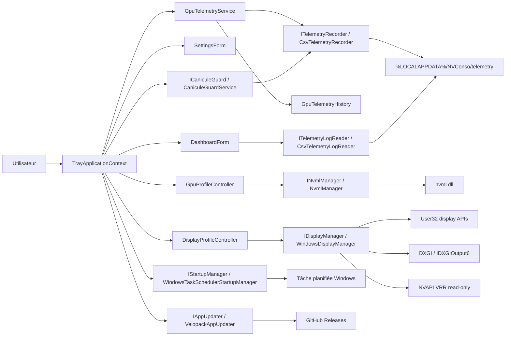

# Architecture WattPilot

Ce document décrit l'architecture réelle de WattPilot. L'application reste une application Windows WinForms, centrée sur la zone de notification.

## Vue d'ensemble



## Entrée applicative

[Program.cs](../NVConso/Program.cs) initialise l'application WinForms, prépare les services et lance [TrayApplicationContext.cs](../NVConso/TrayApplicationContext.cs). L'application demande l'élévation administrateur, car l'écriture du power limit via NVML peut être refusée sans droits élevés.

WattPilot n'a pas de fenêtre principale obligatoire. Le menu tray est le point d'entrée principal. Le dashboard et les préférences sont des fenêtres WinForms optionnelles.

## Profils GPU

Les profils sont appliqués par [GpuProfileController.cs](../NVConso/GpuProfileController.cs) et [NvmlManager.cs](../NVConso/NvmlManager.cs).

Les limites sont calculées depuis les bornes NVML du GPU actif :

- minimum ;
- default/stock, quand NVML l'expose ;
- maximum.

`Stock` et `Max` sont deux états différents. `Stock` revient à la limite constructeur. `Max` applique le plafond maximal exposé par le GPU.

La limite personnalisée est saisie en watts dans l'interface, puis convertie en milliwatts pour NVML.

## Télémétrie

[GpuTelemetryService.cs](../NVConso/GpuTelemetryService.cs) interroge NVML et publie un snapshot partagé. Le tray, le dashboard, Canicule Guard et l'enregistreur persistent utilisent cette source commune.

Deux historiques coexistent :

- [GpuTelemetryHistory.cs](../NVConso/GpuTelemetryHistory.cs) : buffer circulaire en mémoire, utilisé par l'onglet `Temps réel`.
- [CsvTelemetryRecorder.cs](../NVConso/CsvTelemetryRecorder.cs) : persistance CSV/JSON sur disque, utilisée par l'onglet `Historique`.

La relecture est assurée par [CsvTelemetryLogReader.cs](../NVConso/CsvTelemetryLogReader.cs). Elle lit uniquement la journée sélectionnée et downsample les points affichés si nécessaire.

## Profils écran

[DisplayProfileController.cs](../NVConso/DisplayProfileController.cs) coordonne les actions écran. [WindowsDisplayManager.cs](../NVConso/WindowsDisplayManager.cs) lit les écrans actifs et applique le refresh rate via les API Windows.

La phase actuelle supporte uniquement la réduction de fréquence de rafraîchissement, avec ces règles :

- snapshot avant modification ;
- mode supporté obligatoire ;
- `CDS_TEST` avant application ;
- rollback en cas d'échec ;
- pas de changement de résolution ;
- pas de détachement d'écran ;
- pas de modification de la disposition multi-écrans.

HDR est détecté via DXGI/`IDXGIOutput6` quand Windows expose l'état actif. VRR/G-Sync est détecté en lecture seule via NVAPI quand `NvAPI_Disp_GetVRRInfo` est disponible. Si NVAPI est absent, si l'écran n'est pas piloté par NVIDIA ou si le pilote ne fournit pas l'information, l'état reste inconnu ou non supporté.

Les boutons de préférences peuvent ouvrir les paramètres HDR Windows, les paramètres graphiques Windows ou le panneau NVIDIA. Ils ne modifient pas les réglages à la place de l'utilisateur.

## Canicule Guard

[CaniculeGuardService.cs](../NVConso/CaniculeGuardService.cs) reçoit le snapshot courant, les préférences et le profil actif. Il surveille la puissance et la température.

Le service déclenche uniquement :

- une notification ;
- un statut visible dans le tray/dashboard ;
- un événement de pic via l'enregistreur, quand il est disponible.

Il ne change pas automatiquement le profil GPU. Il ne modifie pas les écrans.

## Préférences

Les préférences sont représentées par [AppSettings.cs](../NVConso/AppSettings.cs), validées par [AppSettingsValidator.cs](../NVConso/AppSettingsValidator.cs) et stockées par [AppSettingsStore.cs](../NVConso/AppSettingsStore.cs).

Chemin :

```text
%LOCALAPPDATA%\NVConso\settings.json
```

Le store écrit via un fichier temporaire avant remplacement. Les valeurs inconnues ou invalides sont normalisées quand c'est possible.

## Démarrage Windows

[WindowsTaskSchedulerStartupManager.cs](../NVConso/WindowsTaskSchedulerStartupManager.cs) crée ou met à jour une tâche planifiée utilisateur. La tâche utilise l'argument canonique `--tray`.

L'ancien alias `--minimized` reste reconnu au lancement pour compatibilité, mais les nouvelles tâches utilisent `--tray`.

## Mises à jour

[VelopackAppUpdater.cs](../NVConso/VelopackAppUpdater.cs) utilise Velopack et GitHub Releases. Une application lancée depuis `bin` ou depuis le ZIP portable n'est pas considérée comme installée via Velopack ; la mise à jour automatique y est donc indisponible.

L'installation d'une mise à jour demande une action explicite. WattPilot ne remplace pas son exécutable manuellement.

## Choix de conception

- WinForms est conservé pour rester léger et cohérent avec le produit.
- Les graphes utilisent des contrôles internes, sans dépendance graphique lourde.
- Les I/O persistantes passent par des services dédiés.
- Les intégrations externes utilisent des interfaces pour rester testables.
- Les actions risquées sont désactivées par défaut ou limitées à des changements réversibles.
