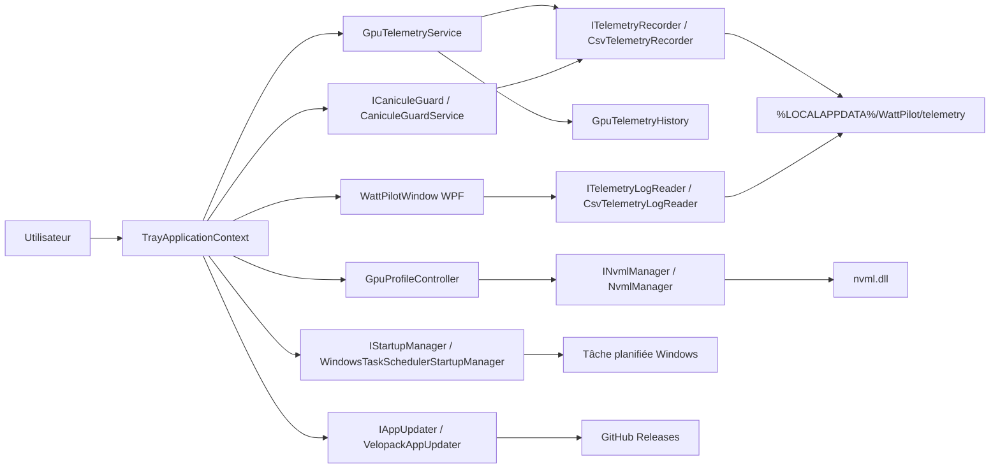

# Architecture WattPilot

Ce document décrit l'architecture réelle de WattPilot. L'application conserve WinForms pour `NotifyIcon` et le menu tray, tandis que l'expérience utilisateur principale est portée par une fenêtre WPF unique.

## Vue d'ensemble



## Entrée applicative

[Program.cs](../NVConso/Program.cs) initialise l'application WinForms pour le tray, prépare les services et lance [TrayApplicationContext.cs](../NVConso/TrayApplicationContext.cs). L'application démarre en droits utilisateur standard ; l'élévation administrateur est demandée uniquement lors d'une action explicite qui doit écrire une limite de puissance GPU ou gérer la tâche de démarrage Windows.

Le menu tray reste le point d'entrée technique, mais l'utilisateur ouvre une seule fenêtre WPF principale : `WattPilotWindow`. Les paramètres et l'historique sont intégrés dans cette fenêtre.

## Profils GPU

Les profils sont appliqués par [GpuProfileController.cs](../NVConso/GpuProfileController.cs) et [NvmlManager.cs](../NVConso/NvmlManager.cs).

Les limites sont calculées depuis les bornes NVML du GPU actif :

- minimum ;
- default/stock, quand NVML l'expose ;
- maximum.

`Normal / Stock` et `Max` sont deux états différents. `Normal / Stock` revient à la limite constructeur. `Max` applique le plafond maximal exposé par le GPU.

La limite personnalisée est saisie en watts dans l'interface, puis convertie en milliwatts pour NVML.

### Helper élevé de session

WattPilot reste lancé en droits utilisateur standard. Pour les changements de mode GPU, l'utilisateur peut choisir :

- `Autoriser pour cette session` : Windows demande une autorisation une fois, puis WattPilot réutilise un helper élevé local pendant la session ;
- `Une seule fois` : WattPilot conserve l'élévation ponctuelle historique pour l'action demandée ;
- `Annuler` : aucune commande GPU n'est envoyée et le profil n'est pas enregistré comme appliqué.

Le helper de session est le même exécutable lancé en mode strict `--elevated-session-helper`. Ce mode est routé avant l'initialisation de l'interface et n'affiche aucune fenêtre. Il accepte uniquement les arguments structurés nécessaires au protocole : nom de pipe, jeton de session, version de protocole, PID parent, expiration UTC et SID de l'utilisateur appelant.

L'IPC utilise un named pipe local au nom imprévisible `WattPilot.GpuSession.{sessionId}.{randomSuffix}`. Le pipe est créé avec `PipeOptions.CurrentUserOnly`, puis chaque requête effectue un handshake avec un jeton de session généré sur au moins 256 bits. Les logs ne contiennent pas ce jeton.

Le protocole accepte uniquement trois commandes GPU :

- `ApplyGpuProfile` ;
- `ApplyCustomPowerLimit` ;
- `RestoreStock`.

Les commandes de démarrage Windows et de réparation de tâche planifiée restent sur l'élévation ponctuelle. Elles ne passent pas par le helper GPU. Le helper n'installe aucun service Windows, ne crée aucune tâche planifiée permanente et ne reçoit aucun argument libre.

La session expire après 15 minutes d'inactivité. Le helper s'arrête aussi si le processus WattPilot parent disparaît. À la fermeture, WattPilot utilise le helper déjà actif pour restaurer `Stock` si l'option est activée, sans afficher une nouvelle demande UAC. Avant l'application d'une mise à jour Velopack, WattPilot demande l'arrêt du helper.

Si l'UAC est validé avec un autre compte administrateur, le pipe limité au compte du helper empêche la réutilisation silencieuse depuis la session utilisateur d'origine. WattPilot retombe alors sur le flux ponctuel ou échoue discrètement selon le contexte.

## Télémétrie

[GpuTelemetryService.cs](../NVConso/GpuTelemetryService.cs) interroge NVML et publie un snapshot partagé. La fenêtre principale, Canicule Guard et l'enregistreur persistent utilisent cette source commune.

Deux historiques coexistent :

- [GpuTelemetryHistory.cs](../NVConso/GpuTelemetryHistory.cs) : buffer circulaire en mémoire, utilisé par les graphes temps réel.
- [CsvTelemetryRecorder.cs](../NVConso/CsvTelemetryRecorder.cs) : persistance CSV/JSON sur disque, utilisée par le panneau historique.

La relecture est assurée par [CsvTelemetryLogReader.cs](../NVConso/CsvTelemetryLogReader.cs). Elle lit uniquement la journée sélectionnée et downsample les points affichés si nécessaire.

## Canicule Guard

[CaniculeGuardService.cs](../NVConso/CaniculeGuardService.cs) reçoit le snapshot courant, les préférences et le profil actif. Il surveille la puissance et la température.

Le service déclenche uniquement :

- une notification ;
- un statut visible dans la fenêtre principale ;
- un événement de pic via l'enregistreur, quand il est disponible.

Il ne change pas automatiquement le profil GPU.

## Paramètres

Les paramètres sont représentés par [AppSettings.cs](../NVConso/AppSettings.cs), validés par [AppSettingsValidator.cs](../NVConso/AppSettingsValidator.cs) et stockés par [AppSettingsStore.cs](../NVConso/AppSettingsStore.cs). Ils sont modifiables depuis un panneau intégré à `WattPilotWindow`, sans fenêtre de préférences séparée.

Chemin :

```text
%LOCALAPPDATA%\WattPilot\settings.json
```

Le store écrit via un fichier temporaire avant remplacement. Les valeurs inconnues ou invalides sont normalisées quand c'est possible. Au lancement réel, il migre `%LOCALAPPDATA%\NVConso` vers `%LOCALAPPDATA%\WattPilot` si l'ancien dossier existe et que le nouveau n'existe pas encore.

## Démarrage Windows

[WindowsTaskSchedulerStartupManager.cs](../NVConso/WindowsTaskSchedulerStartupManager.cs) crée ou met à jour une tâche planifiée utilisateur nommée `WattPilot`. La tâche utilise l'argument canonique `--tray`.

L'ancien alias `--minimized` reste reconnu au lancement pour compatibilité, mais les nouvelles tâches utilisent `--tray`. Une ancienne tâche `NVConso` est détectée puis supprimée après création de la tâche `WattPilot`.

## Mises à jour

[VelopackAppUpdater.cs](../NVConso/VelopackAppUpdater.cs) utilise Velopack et GitHub Releases. Une application lancée depuis `bin` ou depuis le ZIP portable n'est pas considérée comme installée via Velopack ; la mise à jour automatique y est donc indisponible.

L'installation d'une mise à jour demande une action explicite. WattPilot ne remplace pas son exécutable manuellement.

## Choix de conception

- WinForms est conservé pour `NotifyIcon`, le menu tray compact et la boîte de limite personnalisée.
- WPF porte l'UI principale : page de suivi, panneau paramètres et historique intégré.
- Les graphes utilisent des contrôles internes, sans dépendance graphique lourde.
- Les I/O persistantes passent par des services dédiés.
- Les intégrations externes utilisent des interfaces pour rester testables.
- Les actions risquées sont désactivées par défaut ou limitées à des changements réversibles.
